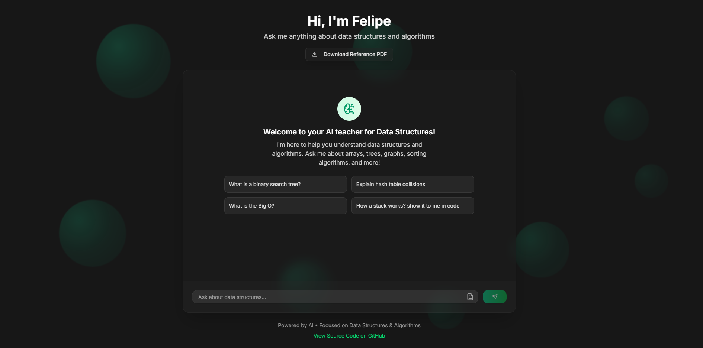

# Felipe — AI-Powered Assistant for Data Structures



**Felipe** is a lightweight AI assistant built with RAG (Retrieval-Augmented Generation) to help users ask questions and retrieve relevant information specifically about **data structures**.

---

## 🚀 Features

- 💬 Ask natural language questions about data structures.
- 📄 Information is retrieved from a structured **PDF source**.
- ⚙️ Built using **LangChain**, **Next.js**, and **Vercel AI SDK**.
- 🧠 **MongoDB** is used as the vector store for efficient semantic search.

---

## 📸 Demo

<p align="center">
  
</p>

---

## 📘 Source Material

All responses are based on a curated PDF about data structures.

👉 [Download the PDF](./src/docs/estruc-datos.pdf)

---

## 🛠️ Tech Stack

- [LangChain](https://www.langchain.com/)
- [Next.js](https://nextjs.org/)
- [Tailwind](https://tailwindcss.com/)
- [Vercel AI SDK](https://sdk.vercel.ai/)
- [MongoDB Vector Store](https://www.mongodb.com/)
- [Vercel](https://vercel.com/)


---

## 📦 Installation

```bash
# Clone the repo
git clone https://github.com/eltatata/Nextjs-langchain-retrievalQA
cd Nextjs-langchain-retrievalQA

# Install dependencies
npm install

# Create your .env file based on .env.example and configure your keys
cp .env.example .env

# Run the development server
npm run dev
